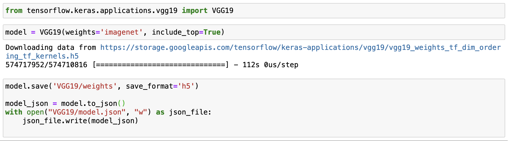

Transfer learning is a popular deep learning technique that allows you to save time and cost of 
training a neural network while achieving great performance at the same time. It leverages existing 
pre-trained models and allows you to tweak them to your task by training only a part of the neural network.

In this tutorial, we will take a pre-trained VGG-19 Keras model that has been trained on a large dataset 
(ImageNet) to classify color images into 1000 categories. We will load this model with KotlinDL, and fine-tune it by 
training only some of its layers to classify images from our own dataset. 

## Data preparation
For the purposes of this tutorial, we have collected a dataset containing images of two kids of birds: eagles and 
pigeons. Next, we have resized the images to be 224 x 224 pixels. This is the same image size as VGG-19 has been 
trained on. It is important for all the images to be of the same size, however, it is not critical for them to 
be of the exact size as what the model was trained on - if needed, we can replace the input layer. 

We've stored the image dataset so that each class is in its own folder: 
```
eagles-pigeons/
    eagles224x224/
    pigeons224x224
```

There are, of course, many ways how you can organize your own dataset. This way makes it easier to get the labels for 
all the examples based on the path.

Now we need to create a `Dataset` from these images. You can do so by converting your images and labels into arrays, 
and building a dataset from those. 
Here's a function that will go through a folder structured as shown above, convert images to FloatArrays, and encode 
labels based on the path into one-hot vectors. 

```kotlin
private fun prepareCustomDatasetFromPaths(vararg paths: String): Dataset {
    val listOfImages = mutableListOf<FloatArray>()
    val listOfLabels = mutableListOf<FloatArray>()
    val numberOfClasses = paths.size
    var counter = 0

    for (path in paths) {
        File(path).walk().forEach {
            try {
                val image = ImageConverter.toNormalizedFloatArray(it)
                listOfImages.add(image)
                val label = FloatArray(numberOfClasses)
                label[counter] = 1F
                listOfLabels.add(label)
            } catch (e: Exception) {
                println("Skipping the following image $it")
            }
        }
        counter += 1
    }

    val sortedData = listOfImages.zip(listOfLabels)
    val shuffledData = sortedData.shuffled()
    val (x, y) = shuffledData.unzip()

    return Dataset.create({ x.toTypedArray() }, { y.toTypedArray() })
}
```  
In the final lines, just before creating a Dataset, we shuffle the data, so that when we split it into training and 
testing portions, we do not get a test set containing only images of one class.    


 
## VGG-19
KotlinDL does not bundle any pre-trained models. You can either train a model from scratch yourself and store
 it and for later use on other tasks, or you can import a pre-trained Keras model with compatible architecture.  

In this tutorial we will load VGG-19 weights that are made available in Keras: 




## Transfer Learning
Now that we can create a Dataset and we have model weights and configuration file, we can put everything together, 
and apply the transfer learning technique. First, let's prepare the data and spit it into 
two parts - training and test set. 

```kotlin
val data = prepareCustomDatasetFromPaths(
    "src/main/resources/eagles-pigeons/eagles224x224",
    "src/main/resources/eagles-pigeons/pigeons224x224"
)

val (train, test) = data.split(0.8)

```

Now, let's define some variables with the paths to the model weights and configuration: 

```kotlin
val WEIGHTS = File("src/main/resources/VGG19/weights.h5")
val VGG19_CONFIG = File("src/main/resources/VGG19/model.json")
val hdfFile = HdfFile(WEIGHTS)
```

Next, we need to parse the model's architecture from the `json` configuration file: 

```kotlin
val (input, otherLayers) = Sequential.loadModelLayersFromConfiguration(VGG19_CONFIG)

```

At this point we need to decide which layers of this model we want to fine-tune, which ones we want to leave as is, and 
if we want to add or remove some layers. You can use `model.summary()` to inspect the model's architecture.

This model consists mainly of Conv2D and MaxPool2D layers, and has a couple of Dense layers at the end. One common way 
to do transfer learning (although, of course, not the only one) is to leave the convolutional layers as is, and re-train 
the dense layers. So this is what we will do: 
- We'll "freeze" all the Conv2D and MaxPool2D layers - the weights for them will be loaded, but they will not be further 
trained.
- The last layer of the original model classifies 1000 classes, but we only have two, so we'll throw it away, and add 
another final prediction layer.   

```kotlin
val layers = mutableListOf<Layer>()

    for (layer in otherLayers) {
        if (layer::class == Conv2D::class || layer::class == MaxPool2D::class) {
            layer.isTrainable = false
            layers.add(layer)
        }
        else {layer.isTrainable = true
            layers.add(layer)
        }
    }

    layers.removeLast()

    layers.add(
        Dense(
            name = "new_prediction_layer",
            kernelInitializer = GlorotUniform(SEED),
            biasInitializer = GlorotUniform(SEED),
            outputSize = 2,
            activation = Activations.Linear
        )
    )

    val model = Sequential.of(input, layers)

```

Finally, we can train this model. The only difference as opposed to training a model from scratch will be 
loading the weights for the frozen layers. These will not be further trained - that's how we leverage the fact that this 
model has already learned some patterns on a much larger dataset.  

```kotlin
model.use {
        it.compile(
            optimizer = Adam(),
            loss = Losses.SOFT_MAX_CROSS_ENTROPY_WITH_LOGITS,
            metric = Metrics.ACCURACY
        )
// The following line loads the weights for frozen layers:        
        it.loadWeightsForFrozenLayers(hdfFile)

        it.fit(
            dataset = train,
            batchSize = 32,
            epochs = 3,
            verbose = false
        )

        val accuracyAfterTraining = it.evaluate(dataset = test, batchSize = 100).metrics[Metrics.ACCURACY]

        println("Accuracy after training $accuracyAfterTraining")
    }
``` 

---
**NOTE**

If you have obtained the pre-trained model's weights in HDF5 format differently from how it is described in this tutorial, 
you may not be able to load them with the default `loadWeightsForFrozenLayers` method.  
If the default method fails to load the weights from a *.h5 file, you can use a helper method - 
`recursivePrintGroupInHDF5File(hdfFile, hdfFile)` to inspect the HDF5 file structure and figure out custom templates 
that are used to store kernel and weights data. With those, you can use `loadWeightsForFrozenLayersByPathTemplates` 
method to load nearly any Keras model weights stored in HDF5. 
Here's an example: 
```kotlin
val kernelDataPathTemplate = "/%s/%s_W_1:0"
val biasDataPathTemplate = "/%s/%s_b_1:0"

it.loadWeightsForFrozenLayersByPathTemplates(hdfFile, kernelDataPathTemplate, biasDataPathTemplate)

```
   
--- 

This is it! 