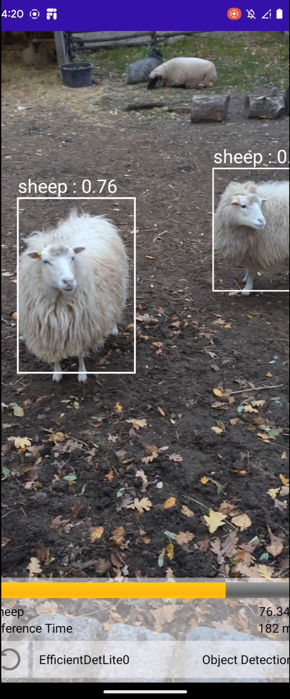
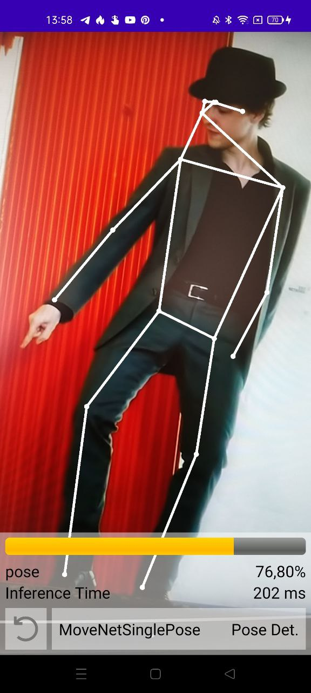
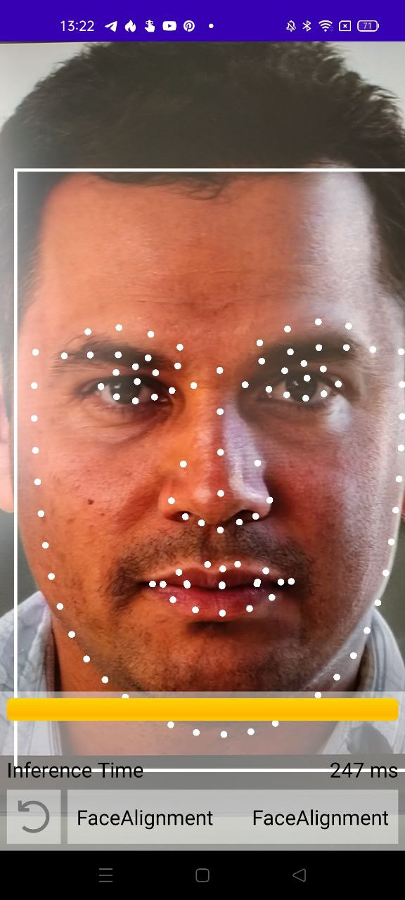

##  KotlinDL Android inference examples

||||
| ---------- | ----------- | ----------- |
|       |        |  |

This example demonstrates how to use KotlinDL for neural network inference on Android devices.
It contains a simple Android app that uses KotlinDL to demonstrate inference of a bunch of pre-trained models for different computer vision tasks.
It's a self-contained project that can be opened in Android Studio and run on a real device or an emulator.

The list of demonstrated models includes:
* MobileNetV1 and EfficientNetV4Lite for image classification
* SSDMobileNetV1 and EfficientDetLite0 for object detection
* MoveNet for human pose estimation
* Face detection and alignment

This application is based on CameraX Android API and uses the latest KotlinDL version.
The actual model inference is performed by the [Onnx Runtime](https://github.com/microsoft/onnxruntime).

This example is a based on [ort_image_classification example](https://github.com/guoyu-wang/ort_image_classification_android)
